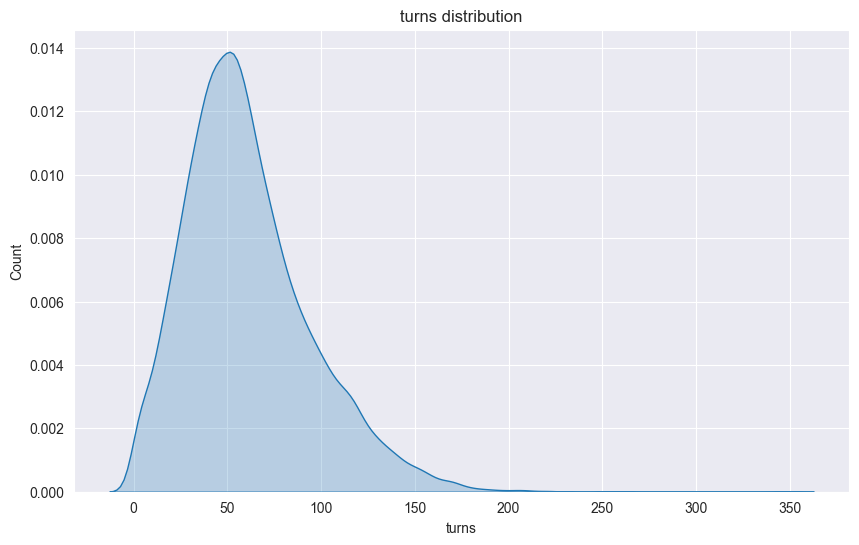
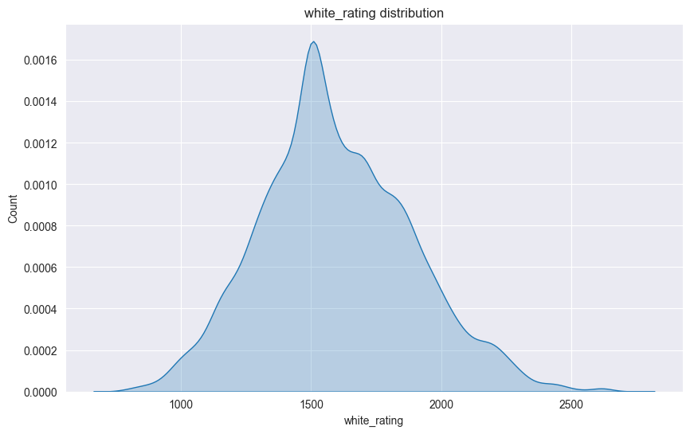
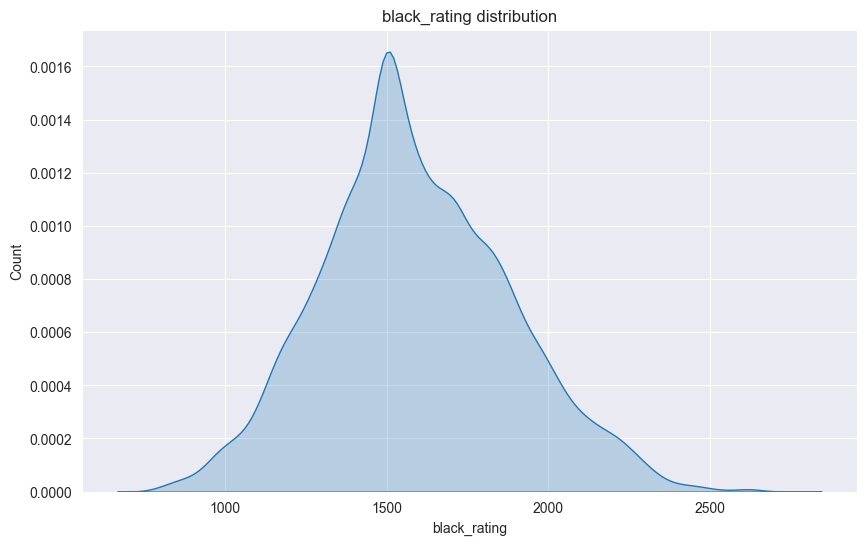
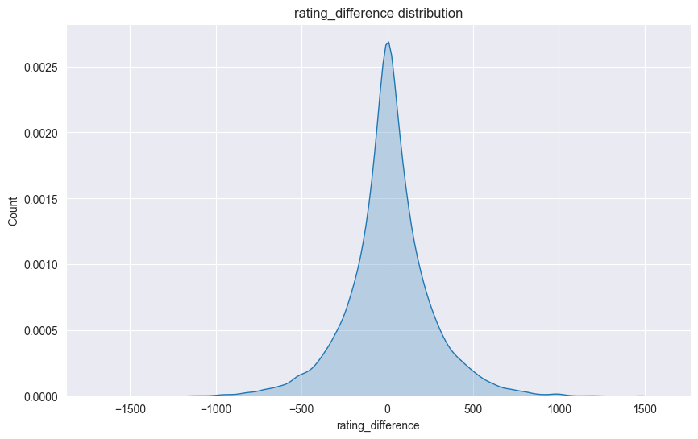
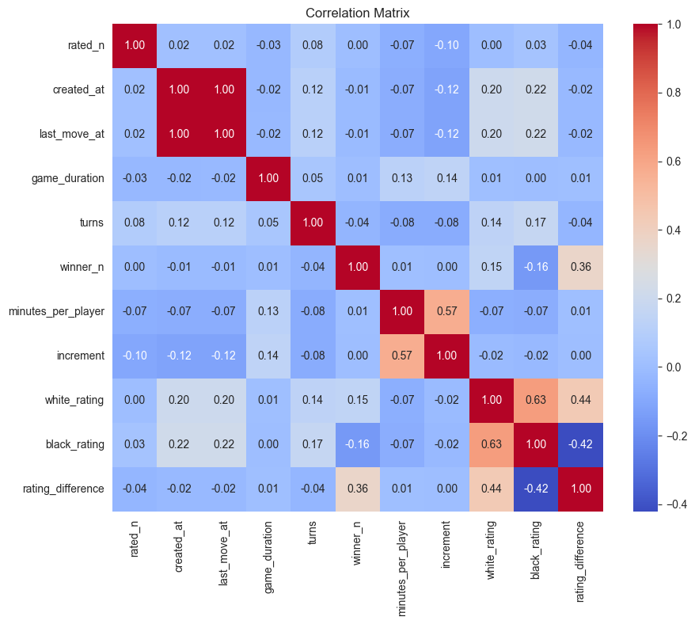

# 🎮 Chess and AI
> **Disclaimer:** This project follows a previous one on student performance, which we found less engaging ([Student performance](Data%20Analysis)).

## 👥 Team

| Name             | School                   | Email                        |
|------------------|--------------------------|------------------------------|
| **Théo Hardy**    | ESILV Engineering School | theo.hardy@edu.devinci.fr     |
| **Gaël Le Mouel** | ESILV Engineering School | gael.lemouel@gmail.com        |
| **Robin L'hyver** | ESILV Engineering School | robinlhyver@gmail.com         |

---

## 💻 Project Overview

This project explores the various factors that affect **game outcomes**. Using **machine learning** techniques, we aim to:

- 🏆 **Predict the winner** of a game based on key factors from the dataset.
- 🏅**Classify the best opening moves** to increase the chances of winning.
- ❓**Identify Blunders or Critical Position** to detect the **turning points** of the game.
- 📈 Assess the **influences** on game outcomes, including player statistics and game conditions.
- 🤖 Evaluate whether the **dataset** and the **models** that we chose are reliable for making accurate predictions using machine learning models.
- 🚀 **Improve our understanding of AI** and its applications in analyzing chess data.

### Why This Project? 🎯

We are big fans of games and are interested in understanding the factors that contribute to winning. This project helps us explore how factors like **player ratings**, **game time**, and **opening moves** influence the outcome of a game.
As computer science students, we aim to **enhance our knowledge of artificial intelligence** by applying it to real-world data and evaluating how effective the dataset is in making reliable predictions.

## 📊 Data Set

**Data Set used :**

### Kaggle Data Set

The Kaggle Data Set contains around **20,000 chess games** with the following features:
- `id`: Game ID
- `rated`: Whether the game is rated
- `created_at`: Date and time the game was created
- `last_move_at`: Date and time of the last move of the game
- `turns`: Move number in the game
- `victory_status`: Game outcome (mate, draw, resign, outoftime)
- `winner`: Winner of the game (white, black, draw)
- `increment_code`: Time control, first number is the time in minutes  per player and the second one is the number of second added to each player time for every moves ([Time control](https://www.chess.com/terms/chess-time-controls))
- `white_id`: White player ID
- `white_rating`: White player rating
- `black_id`: Black player ID
- `black_rating`: Black player rating
- `moves`: Moves in standard chess notation 
- `opening_eco`: Opening code ([Opening List](https://www.365chess.com/eco.php))
- `opening_name`: Opening name
- `opening_ply`: move number per opening

The data set comes from the [Lichess](https://lichess.org/) website, which is a free online chess game platform.

After analysing the data, we found that the Kaggle dataset do not contain enough data.

### Elite Data Set

Lichess provides a database of **Every game played on Lichess** on its [webstie](https://database.lichess.org/).
We decided to use the **Lichess Elite Database** created by a user of the Lichess API. The data set contains all the 2300 elo or more game datas. 
Elo corresponds to the player's rating, which is a measure of the player's skill level. The higher the Elo, the better the player.
2300 elo is the minimum rating to be considered a ***master*** in chess. 
The high quality games in the database might help us to have a more accurate prediction.

The Elite Data Set contains a lot of games in the format of **PGN** [Portable Game Notation (Chess.com)](https://www.chess.com/terms/chess-pgn) files. The PGN format is a standard format for recording chess games. It contains the following information:
- `Event`: The name of the event or match
- `Site`: The location of the event
- `Date`: The data when the game was played
- `LichessURL` : The URL of the game on Lichess 
- `Round`: The specific round of the event
- `White`: The player who played white
- `Black`: The player who played black
- `Result`: The result of the game (1-0, 0-1, 1/2-1/2)
- `WhiteElo`: The Elo rating of the white player
- `BlackElo`: The Elo rating of the black player
- `ECO`: The opening code
- `Opening`: The name of the opening
- `TimeControl`: The time control of the game
- `Termination`: The reason the game ended (checkmate, draw, time, etc.)
- `WhiteRatingDiff`: The change in the white player's rating after the game
- `BlackRatingDiff`: The change in the black player's rating after the game
- `Moves`: The moves of the game in standard chess notation

A big part of the features provided in the PGN files do not interest us for our analysis.
**We will mostly focus on the features that we found in the Kaggle dataset.**
To use the data set, we first converted the data from the PGN files to a new dataset in CSV format.
To do this, we used the python programs in the [Elite PGN files](Chess_Project/Elite%20PGN%20files) folder.
The programs use the [python-chess](https://python-chess.readthedocs.io/en/latest/) library that provides tools to easily read and write PGN files.
One of the programs is specifically designed to extract the game move list alongside the outcome of the game from the PGN files. 
The other extracts other features such as the *players' ratings*, the *opening code*, the *turn number* and the *victory status*.
As the programs were taking a lot of time to convert the data, we decided to use samples of the data to test our models.
We first extracted 10000 games from the PGN files to test our models and then extracted 1,000,000 games.

- 1M row CSV sample extracted from the PGN files : [1M Games Elite Data Set (CSV)](Chess_Project/Data/elite_chess_games_features-1M_Games.zip)
- 100k row move list CSV sample extracted from the PGN files : [100k Games Elite Data Set (CSV)](Chess_Project/Data/elite_chess_games_moves.csv)

---

## 🔬 Methodology
### Data Preprocessing

Before beginning the statistic analysis we needed to clean our datasets. 
For instance, we erased rows with **missing values** and deleted **duplicate rows**.

More of that, we have done some **feature engineering** to improve the quality of our dataset.

To train models, we needed to encode the categorical features.
We principally used the **One-Hot Encoding** technique to encode the categorical features in the dataset. This technique converts each category value into a new column and assigns a 1 or 0 (True/False) value to the column.

### Existing Models

Chess is very famous in the AI community, and many models have been developed to predict the best move in a given position such as **AlphaZero** and **Stockfish**. To help us develop our own, we will use these models. (see more : [Chess Engine](Chess_Project/Chess%20Engine))

#### AlphaZero

[AlphaZero (deepmind.google)](https://deepmind.google/discover/blog/alphazero-shedding-new-light-on-chess-shogi-and-go/) is a computer program developed by Google DeepMind in 2017. It uses the same reinforcement learning techniques as **AlphaGo**, but it is also trained on chess.
AlphaZero is a general-purpose algorithm that can learn to play other games as well. It uses a deep neural network to evaluate positions and select moves.

#### Stockfish

Stockfish is a free and open-source chess engine developed by Tord Romstad, Marco Costalba, and Joona Kiiski.
At its beginning in 2008, Stockfish was a chess engine that used the minimax algorithm with alpha-beta pruning to search the game tree. It also used a simple evaluation function to evaluate the positions.
The engine was entirely handcrafted, and the evaluation function was based on the knowledge of the game's authors.
With the introduction of [efficiently updatable neural network (wikipedia)](https://en.wikipedia.org/wiki/Efficiently_updatable_neural_network)
Stockfish has been able to use a neural network to evaluate the positions [(Remove classical evaluation)](https://github.com/official-stockfish/Stockfish/commit/af110e02ec96cdb46cf84c68252a1da15a902395).

#### Which one is better ?
According to google, Alpha zero might be better than Stockfish as this very pretty looking animation shows:

*Alpha Zero performances according to Google DeepMind*

However, there are few parameters to take into account when comparing the two engines.
The two engines **do not use the same type of Neural Network** when it comes to play the game. 
The "Efficiently updatable neural network" (NNUE) used by Stockfish is very efficient on CPU 
when CNN used by AlphaZero requires a lot of GPU power.

To compare the two engines, we created a python script that makes the two engines play against each other. The script is available in the [Chess Engine](Chess_Project/Chess%20Engine) folder. 
It results that running locally with the *"t3-512x15x16h-distill-swa-2767500"* neural network provided by LCZero on its [website](https://lczero.org/play/networks/bestnets/), Stockfish wins almost every time.

## 📈 Data Analysis

### Important Features :

#### Turns : 

This feature shows us the number of turns in the game. It is a good indicator of the game length. This feature will be useful for the project and for the learning model that we will use.

We can see a pin around 50 turns . This is normal because the average game length is around 40 turns. Then we have some extra values that are higher than 100 turns. 

#### Ranking : 

The rank of each player is important, it tells us the difference of level between 2 players and there knowledge of the game.

We can see that the white and black rating are the same :

| white_rating | black_rating | raking difference |
|--------------|--------------|-------------------|
||

We see that the ranking difference between the players is not important and we can assume that the players have the same levels.

#### correlation matrix

To help us with every features presents in the dataset. With this feature we can see the correlation between each features and the target variable.

## 🔎Evaluation & Analysis

### Predicting the winner and the victory status of a game using the dataset features

To predict the winner and victory status we tried three strategies in order to see which one had the best accuracy. To do the prediction we used at must 5 out of 16 features : the number of turns in the game, the players ratings, the opening code used and the number of play of this opening. We chose the Random Forest algorithm because it is the best supervised classification algorithm in our opinion.
The three strategies were the following : 
- prediction with opening code feature encoded with binary encoding, 
- prediction with opening code feature encoded with label encoding, 
- prediction with only the players ratings and the number of turns in the game.

In the first strategy we used Binary encoding to use the opening code feature. This type of encoding allow us to reduce the dimensionality compare to a one-hot encoding but still use a powerful encoding like the on-hot one. We found a 36% accuracy of the Random Forest algorithm.
For the second strategy we used a Label encoding this time of the opening feature. It does not increase the dimensionality of our dataset but it will create a little bias in the algorithm as the label encoding is used for ordered feature and the opening code is not one of this kind. The random forest algorithm give us a 37% accuracy.
The last strategy was to reduce the number of feature to only the one which are really correlated to the winner and victory status of the game. We found a 35% accuracy.

In conclusion, although the random forest is the best supervised algorithm for classification problem it appears that it cannot predict the winner and the victory status of the game easily.

### Predicting the winner

---

## References
- [Complete guide to encoding categorical features](https://kantschants.com/complete-guide-to-encoding-categorical-features)
- [Elo Rating System in Chess](https://www.chess.com/terms/elo-rating-chess)