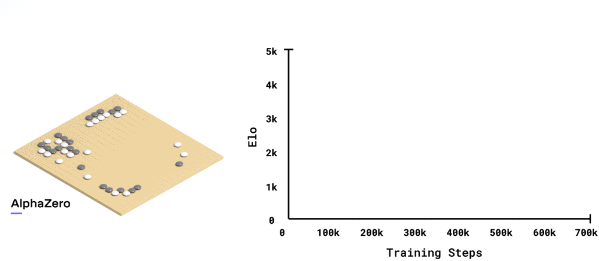

# 🎮 Chess and AI
> **Disclaimer:** This project follows a previous one on student performance, which we found less engaging ([Student performance](Old_Project)).

## 👥 Team

| Name              | School       | Email                         |
|-------------------|--------------|-------------------------------|
| **Théo Hardy**    | ESILV Paris  | theo.hardy@edu.devinci.fr     |
| **Gaël Le Mouel** | ESILV Paris  | gael.lemouel@gmail.com        |
| **Robin L'hyver** | ESILV Paris  | robinlhyver@gmail.com         |

---

## 💻 Project Overview

This project explores the various factors that affect **game outcomes**. Using **machine learning** techniques, we aim to:

- 🏆 **Predict the winner** of a game based on key factors from the dataset.
- 🏅 **Classify the best opening moves** to increase the chances of winning.
- 📈 Assess the **influences** on game outcomes, including player statistics and game conditions.
- 🤖 Evaluate whether the **dataset** and the **models** that we chose are reliable for making accurate predictions using machine learning models.
- 🚀 **Improve our understanding of AI** and its applications in analyzing chess data.

### Why This Project? 🎯

We are big fans of games and are interested in understanding the factors that contribute to winning.
This project helps us explore how factors like **player ratings**, **game time**, and **opening moves** influence the outcome of a game.
As computer science students, we aim to **enhance our knowledge of artificial intelligence** by applying it to real-world data and evaluating how effective the dataset is in making reliable predictions.


## 📊 Data Set

**Data Set used :**

[](https://www.kaggle.com/datasets/datasnaek/chess/data)
[](https://database.nikonoel.fr/)


### Kaggle Data Set

The Kaggle Data Set contains around **20,000 chess games** with the following features:
- `id`: Game ID
- `rated`: Whether the game is rated
- `created_at`: Date and time the game was created
- `last_move_at`: Date and time of the last move of the game
- `turns`: Move number in the game
- `victory_status`: Game outcome (mate, draw, resign, outoftime)
- `winner`: Winner of the game (white, black, draw)
- `increment_code`: Time control, first number is the time in minutes  per player and the second one is the number of second added to each player time for every moves ([Time control](https://www.chess.com/terms/chess-time-controls))
- `white_id`: White player ID
- `white_rating`: White player rating
- `black_id`: Black player ID
- `black_rating`: Black player rating
- `moves`: Moves in standard chess notation 
- `opening_eco`: Opening code ([Opening List](https://www.365chess.com/eco.php))
- `opening_name`: Opening name
- `opening_ply`: move number per opening

The data set comes from the [Lichess](https://lichess.org/) a free online chess game platform. 
Upon analyzing the data, we determined that the Kaggle dataset lacks sufficient data for our needs."


### Elite Data Set

Lichess provides a comprehensive database of every game played on its platform, accessible via its [webstie](https://database.lichess.org/).
For our project, we opted to use the **Lichess Elite Database**, which is curated by a user of the Lichess API. 
This dataset includes games played by individuals with an Elo rating of 2300 or higher. 
The Elo rating is a measure of a player's skill level, with higher values indicating better performance. 
A rating of 2300 is the minimum required to be considered a master in chess. 
The high-quality games in this database are expected to enhance the accuracy of our predictions.

The Elite Data Set is available in **PGN** [Portable Game Notation (Chess.com)](https://www.chess.com/terms/chess-pgn) format, a standard for recording chess games.
Below is an example of a PGN file with its features (comments are enclosed in curly brackets):
```PGN
[Event "Rated Blitz game"]    {Event name}
[Date "2020.02.01"]           {Date of the game}
[Round "-"]                   {Round of the event (if available)}
[White "bluepower"]           {White player name}
[Black "Piratalokoo"]         {Black player name}
[Result "0-1"]                {Result of the game}
[WhiteElo "2299"]             {White player Elo}
[BlackElo "2469"]             {Black player Elo}
[ECO "A15"]                   {Opening code}
[Opening "English Opening: Anglo-Indian Defense, King's Indian Formation"]
[TimeControl "180+0"]         {Time control}
[UTCDate "2020.02.01"]      
[UTCTime "00:00:11"]
[Termination "Normal"]        {Game termination status}
[WhiteRatingDiff "-3"]        {White player rating change after the game}
[BlackRatingDiff "+4"]        {Black player rating change after the game}

{All the moves of the game}
1. Nf3 Nf6 2. c4 g6 3. Nc3 d5 4. cxd5 Nxd5 5. Qb3 Nb6 6. d4 Be6 7. Qd1 c5
8. dxc5 Qxd1+ 9. Nxd1 Na4 10. Be3 Nd7 11. b4 Bg7 12. Rc1 Bxa2 13. Bd4 e5
14. Ba1 O-O 15. e4 a5 16. Bb5 Bh6 17. Ne3 axb4 18. Bxd7 f6 19. Bxa4 Rxa4
20. O-O b3 21. Rc4 Rfa8 22. Ng4 Rxc4 23. Nxh6+ Kg7 24. Ng4 Rxe4 25. Ne3 Rc8
26. Rc1 Rb4 27. Bb2 Rb5 28. Nd2 Rbxc5 29. Re1 Rc2 30. Nxc2 Rxc2 0-1
```

Many of the characteristics provided in the PGN files are not relevant to our analysis. 
We will primarily focus on the features found in the Kaggle dataset. 
To utilize the dataset, we first converted the data from the PGN files to a CSV format. 
This was achieved using Python programs located in the [Elite PGN files](Chess_Project/Elite%20PGN%20files) folder.
There programs leverage the [python-chess](https://python-chess.readthedocs.io/en/latest/) library which offers tools for reading and writing PGN files.

One program is specifically designed to extract the game move list along with the game outcome from the PGN files. 
Another program extracts additional features such as player ratings, opening codes, turn numbers, and victory statuses. 
Due to the time-consuming nature of data conversion, we initially used samples to test our models. 
We first extracted 10,000 games from the PGN files, followed by 1,000,000 games. 
Ultimately, we extracted a total of 6,726,641 games from the database to test our models

- 1M row CSV sample extracted from the PGN files : [1M Games Elite Data Set (CSV)](Chess_Project/Data/elite_chess_games_features-1M_Games.zip)
- 100k row move list CSV sample extracted from the PGN files : [100k Games Elite Data Set (CSV)](Chess_Project/Data/elite_chess_games_moves_100k_Games.csv)

---

## 🔬 Methodology
### Data Preprocessing


Before starting creating a model, we needed to preprocess the data to make it suitable for our models.
We analysed it to see what informations we could extract from it and what we could do to improve the quality its quality
(see more : [Data analysis](#-Data-Analysis)).
For instance, we erased rows with **missing values** and deleted **duplicated rows**.

More of that, we have done some **feature engineering** to improve the quality of our dataset.

To train models, we needed to encode the categorical features.
We principally used the **One-Hot Encoding** technique to encode the categorical features in the dataset. 
This technique converts each category value into a new column and assigns a 1 or 0 (True/False) value to the column.
We also used **Label Encoding** to encode the opening code feature.
This technique converts each category value into a unique number.

### Existing Models

Chess is very famous in the AI community, and many models have been developed to predict the best move in a given position such as **AlphaZero** and **Stockfish**. 
To help us develop our own, we will use these models. (see more : [Chess Engine](Chess_Project/Chess%20Engine))

#### AlphaZero

[AlphaZero (Deepmind)](https://deepmind.google/discover/blog/alphazero-shedding-new-light-on-chess-shogi-and-go/) is a computer program developed by Google DeepMind in 2017.
It uses the same reinforcement learning techniques as **AlphaGo**, but it is also trained on chess.
AlphaZero is a general-purpose algorithm that can learn to play other games as well. It uses a deep neural network to evaluate positions and select moves.

#### Stockfish

Stockfish is a free and open-source chess engine developed by Tord Romstad, Marco Costalba, and Joona Kiiski.
At its beginning in 2008, Stockfish was a chess engine that used the minimax algorithm with alpha-beta pruning to search the game tree. 
It also used a simple evaluation function to evaluate the positions.
The engine was entirely handcrafted, and the evaluation function was based on the knowledge of the game's authors.
With the introduction of [efficiently updatable neural network (wikipedia)](https://en.wikipedia.org/wiki/Efficiently_updatable_neural_network)
Stockfish has been able to use a neural network to evaluate the positions.

#### Which one is better ?
According to google, Alpha zero might be better than Stockfish as this very pretty looking animation shows:

*Alpha Zero performances according to Google DeepMind*

However, there are few parameters to take into account when comparing the two engines.
The two engines **do not use the same type of Neural Network** when it comes to play the game. 
The "Efficiently updatable neural network" (NNUE) used by Stockfish is very efficient on CPU 
when CNN used by AlphaZero requires a lot of GPU power.

To compare the two engines, we created a python script that makes the two engines play against each other. The script is available in the [Chess Engine](Chess_Project/Chess%20Engine) folder. 
It results that running locally with the *"t3-512x15x16h-distill-swa-2767500"* neural network provided by LCZero on its [website](https://lczero.org/play/networks/bestnets/), Stockfish wins almost every time.
For our models, we will use Stockfish as it is more efficient and easier to run on mid-range computers.

## 📈 Data Analysis

In order to have a better understanding of our datasets, we started by analysing them by using some python visualisation tools.
We used [**pandas**](https://pandas.pydata.org/) library with along with  the [**seaborn**](https://seaborn.pydata.org/) library to plot the data
Here are some information that we extracted from the datasets:
- ### Kaggle Dataset : 
  - [Full analysis notebook](Chess_Project/KaggleDataAnalysis.ipynb)
  - Sample of around **20000 games**.
  - **1/5 of the games are not rated**. 
  - **Draws represents less than 5% of the games**.
  - **Ranking**: 
    - Black and White rating are mostly the same and is between **784 and 2723**
    - **Mean ELO** is around 1550 ELO which corresponds to the level of an average player.

    | Black ELO (White is almost the same)                                         | ELO difference                                                                   |
    |------------------------------------------------------------------------------|----------------------------------------------------------------------------------|
    | <br/>*Black Elo Distribution* | <br/>*ELO difference ditribution* |
  - Average game length is around **60 moves**
- ### Elite Dataset :
  - This data set comes from the **same source as the Kaggle dataset** but contains more games ONLY from the best players (**2200 ELO or more**).
  - [Full analysis notebook](Chess_Project/EliteDataAnalysis.ipynb)
  - Sample of around **6,5 Millions games**.
  - All the games are rated
  - **Draws represents 10% of the games**.
- **Ranking**: 
    - Black and White rating are mostly the same and is between **2300 and 3200**
    - **Mean ELO** is around 1550 ELO which corresponds to the level of an average player.

    | White ELO (Black is almost the same)                                                 | ELO difference                                                 |
    |--------------------------------------------------------------------------------------|----------------------------------------------------------------|
    | <br/>White rating distribution. | <br/>*ELO difference ditribution* |
  - Average game length is around **82 moves**
  - **Note**: High ELO player likes to play very short games even though the average game length is higher than the Kaggle dataset. They play faster.

### correlation matrices

To help us with every features presents in the dataset. With this feature we can see the correlation between each feature for the two datasets :
- **Kaggle Dataset**:
  
  * correlation matrix of all the features in the Kaggle dataset
- **Elite Dataset**:
  In this data set, we used Hot-one encoding to encode the categorical features with PCA for the more than 300 openings.
  
    * correlation matrix of all the features in the Elite dataset

Those matrices show us that the most useful features to predict the winner of a game are the players ratings.

## 🔎Evaluation & Analysis

### Basic Prediction : Predicting the game winner based basic information of the game

Chess winner prediction is usually the first thing someone do when trying AI on a chess dataset. Even though we want to try other thing we will do this type of prediction first to begin our project.  
On the kaggle dataset we used a Random Forest model to predict the winner (black, white or draw) based on the rankings of the players and the length of the game in terms of turns.  
The F1 score on accuracy for the Random Forest is 68%. It appears that the model struggle to predict draw result as the F1 score on the draw results is really low, 3% !

### Predicting the winner and the victory status using the opening feature

We aimed to dig deeper into predicting the outcome of a chess game by not only determining the winner but also predicting the victory status (checkmate, out of time, resignation).

To predict the winner and victory status with the opening feature we tried four strategies in order to see which one had the best accuracy.  
To do the prediction we used at must 5 out of 16 features : the number of turns in the game, the players ratings, the opening code used and the number of play of this opening. We chose the Random Forest algorithm because it is the best supervised classification algorithm in our opinion.  
The first three strategies were the following : 
- prediction with opening code feature encoded with binary encoding, 
- prediction with opening code feature encoded with label encoding, 
- prediction with only the players ratings and the number of turns in the game to compare.

In the first strategy we used Binary encoding to use the opening code feature. This type of encoding allow us to reduce the dimensionality compare to a one-hot encoding but still use a powerful encoding like the one-hot one. We found a 36% accuracy of the Random Forest algorithm.  
For the second strategy we used a Label encoding this time of the opening feature. It does not increase the dimensionality of our dataset but it will create a little bias in the algorithm as the label encoding is used for ordered feature and the opening code is not one of this kind. The random forest algorithm give us a 37% accuracy.  
The third strategy was to reduce the number of feature to only the one which are really correlated to the winner and victory status of the game. We found a 36% accuracy.

Even though we did not aim to have the perfect accuracy on our model, we were pretty surprised by the low accuracies found. But we can explain this low accuracy with the fact there is more possible results (7) and some results have more data (black win and white win). We can confirm this with the average weighted variable which is always of 34%. It says to us that from the 7 possible results only 2 are really represented (weighted) in the F1 score, and it might be the only 2 with more than 1000 data (black win and white win).  

If you follow me there were 4 strategies to tried and we only tried 3 so far. The last strategy is based on the work of another [ML project](https://github.com/samiamkhan/4641Project/). This project has a similar goal : predict the game outcome with the opening. But it use a totally different strategy : it does not use a Random Forest but multiple Decision Tree. For each unique n-first moves we make a Decision Tree to predict the game outcome and see the average accuracy of all the Decision Tree.
We tried this strategy from the 2 first moves to the 10 first moves as all game does not have the same length of opening but the majority of the openings have between 2 and 10 moves. We obtained this accuracy graph.  


*Average accuracy of all the Decision Tree depending on the n-first moves*

In conclusion, although the random forest is the best supervised algorithm for classification problem it appears that it cannot predict the winner and the victory status of the game easily. The Decision Tree strategies have a better result but it is more the result of multiple model rather than one single model.

### Predicting the winner only with the early moves, without information about the players.

Given the previous sections, we identified that players' ratings and their differences are crucial features for predicting the winner of a chess game. 
We aimed to explore further by investigating whether it is possible to predict the winner of a game solely based on the initial moves.

To achieve this, we utilized [Stockfish](https://stockfishchess.org/) chess engine to evaluate the positions after each move.
This evaluation provided numerical values representing the game's state, which we used to train our models. 
Initially, we verified the accuracy of Stockfish's evaluations by comparing the final evaluation of each game to the actual winner, achieving an 86% accuracy.


*Simple model results with Stockfish evaluation on 1500 games. Draw margin represent the evaluation number below which we considered the game as a draw*

We then performed feature engineering to extract trends from the Stockfish evaluations, such as mean, variance, and sign changes. 
Using these features, we trained several models, including Random Forest, Gradient Boosting, and Support Vector Machine (SVM) with a linear kernel. 
Our initial results showed that the models could predict the winner with around 75% accuracy when considering 80% of the game moves.


*Performances of the pretrained models depending on the percentage of the move taken into account*

Those graphs evidences some points :
- The **Support Vector Machine** model is properly set up as the prediction accuracy stay below 50%.
This can also be explained by the fact that in this first attempt, we considered the draws in the dataset, although it 
represents only 10% of our data. 
- For our other models, to reach 55% of accuracy, we need to take half of the game into account.
- The maximum accuracy is around 75% for the **Random Forest** and **Gradient Boosting** models.
- Our models seem te biased as the curves are clearly not smooth. 

After some adjustments such as :
- **Removing the draws** from the dataset
- Taking the time to extract **5000 games evaluation** from the PGN files and stockfish to have a more consistent dataset
- **Scaling the features** to have a better performance

We obtain the following results:


*Performances of the pretrained models depending on the percentage of the move taken into account with adjustments*

Performance seems better:  
- The three models exhibit similar accuracy, which increases with the number of moves considered, despite their different approaches.  
- The maximum accuracy is around **78% for all three models** when considering 80% of the game moves.  
- The results appear to be more consistent as the curves are smoother.  
- The **computation time to train the three models is very low** once the evaluations are extracted (less than 1 second for 4000 games).  

However, it is important to note that removing the draws from the dataset means the model only needs to perform binary classification.
This implies that 50% accuracy is the minimum acceptable performance, and therefore, achieving 60% accuracy is not particularly impressive. 
Based on this, we can conclude that our models are not sufficiently accurate to predict the winner of a game based solely on the early moves. 

With our results, we can state that we can predict the outcome of a game with 60% accuracy using half of the game moves. 
However, even though we know that our dataset has an average game length of 82 moves, we do not know the exact number of moves in a live game. 
We would like to determine how many moves (in absolute terms) are needed to predict the outcome of a game with 60% accuracy.

Here are the results after computation:


*Performances of the pretrained models depending on the move count considered on 5000 games*

We can note that the accuracy seems to have **reached its peak around 85%** for 80 moves, which is logical as we evaluated the precision of Stockfish's evaluation to 86% and the mean game length is 82 moves. 
We can state that we can predict the outcome of a game with 70% accuracy using the first 40 moves.

### Predicting the opening played by a player

To predict the opening played by a player we thought of using another model like a KNN but we found [this project](https://github.com/MathewAaron/chess-opening-prediction) with a CNN model and we thought it would be a good way to try this type of model ! 

We used the kaggle dataset for this part.

We only used the first 6 moves of a game, the name of the opening used and the result of the game. To make the life easy to our model we kept the strategy of the original author which was to restrict the opening name to the base name and not use the variation.  
We transformed the moves into tensor with a [Large Model sentence transformer](https://huggingface.co/sentence-transformers/paraphrase-MiniLM-L6-v2/discussions) in order to fill the moves into a 1D convolutional network.

The model architecture consists of 5 layers with the following architecture : 
- 3 layers with each a 1D convolutional layer, a Max-pool layer, a batching normalisation and a ReLU activation layer
- Fed into a fully connected layer with batching normalization, ReLu activation and a Dopout layer.

After training and testing the model we have an accuracy of 95% !  
We can see with following confusion matrix that the accuracy reach more 99% when speaking of Scandinavian Defense, King's Pawn Defense and French Defense (2nd most use in the dataset). On the other hand the worst accuracy score has been made on the most used opening in the dataset, the Sicilian Defense.


*Confusion matrix of our CNN model*


Below is the loss curve that tell us that the error at the beginning was a bit high but it reduces a lot at the end.


*Confusion matrix of our CNN model*

### Extra study : Large Language Models and Chess

We tried to use **LLM models** to see if they could play chess or predict game outcomes. 
We first tried using [Google Gemini API](https://aistudio.google.com/apikey) asking it to evaluate the position of a game as Stockfish would have done it. 
At our surprise, **the model literally told that it was not able to perform good on the task and that we should use a chess engine instead**.
Let's dive into the subject to see why : 

We took a look at this funny video on YouTube : [Google vs ChatGPT: INSANE CHESS (YouTube, 2023)](https://youtu.be/FojyYKU58cw).
It shows an example of two LLM models playing chess against each other.
The Youtuber used the ChatGPT model to play against the Bard model (older version of Gemini).
The very first moves are not that bad as they are from very common openings. 
However, the game quickly became... *chaotic*. It started with this move from ChatGPT :

[](https://youtu.be/FojyYKU58cw?t=98)
*ChatGPT illegal move in this sample game against Bard*

ChatGPT decided to play a pawn backward which is not allowed in chess.
As the game goes on, the moves are more and more chaotic and the game ends up in a draw by Bard...
in a very advantageous position for it. The model claimed that the moves were repeated 3 times which was false.

Regarding this game, we could claim that LLMs are not good at playing chess.
We took a closer look into the subject and watched more serious videos and papers (see [References](#LLM-and-Chess)), it turns out that we need to consider some other factors.
LLM models used in the video are "Chat" models that are trained to put the good words in the right order regarding a **context**. 
These kinds of models can not really "*reason*" about the game and the position of the pieces without a proper context.
As the chess openings are very famous and very well documented, the models can play the first moves of the game without major problems.
However, as the game goes on, the models are not able to reason about the very particular position of the game, and they start to make mistakes.
It is quite understandable as it is estimated there are **around 10<sup>40</sup>** possible legal position in chess board.
This number grows to 10<sup>120</sup> when considering all the possible positions of the pieces on the board 
(including the illegal ones that are clearly taken in account by LLMs as we see in the video).

The best way to make LLMs play chess it to give them a **context**. 
As they are very good at predicting the next word in a sentence, we give them the beginning of a PGN file and ask them to predict the next part of it.
for instance :
```PGN
[White "Garry Kasparov"]
[Black "Magnus Carlsen"]
[Result "1/2-1/2"]
[WhiteElo "2900"]
[BlackElo "2800"]

1. e4
```
Then we ask it to predict the next word.
Other advantage of this technique is that the model have the complete context of the game as all the moves are given to it.

We tried to use this technique to make a GPT model actually being able to play chess. We used the Gemini model from Google.
We made it play times against Stockfish and LC0. It was never able to win a single game against them even setting up their ELO very low.
Gemini seems to not be able to play well at chess.

---

## 📖References

- [Complete guide to encoding categorical features](https://kantschants.com/complete-guide-to-encoding-categorical-features)
- ### Data Preprocessing (Useful resources about Chess Data)
  - [Portable Game Notation (Chess.com)](https://www.chess.com/terms/chess-pgn)
  - [ECO Codes (365Chess.com)](https://www.365chess.com/eco.php)
  - [Chess Time Controls (Chess.com)](https://www.chess.com/terms/chess-time-controls)
  - [Elo Rating System in Chess (Chess.com)](https://www.chess.com/terms/elo-rating-chess)
  - [Chess Notation (Chess.com)](https://www.chess.com/terms/chess-notation)
- ### Chess Engines
  - [Stockfish](https://stockfishchess.org/)
  - [LCZero](https://lczero.org/)
  - [AlphaZero: Shedding new light on chess, shogi, and Go (DeepMind, 2018)](https://deepmind.google/discover/blog/alphazero-shedding-new-light-on-chess-shogi-and-go/)
  - [Remove classical evaluation (Github, 2023)](https://github.com/official-stockfish/Stockfish/commit/af110e02ec96cdb46cf84c68252a1da15a902395)
  - [How do Chess Engines work? Looking at Stockfish and AlphaZero | Oliver Zeigermann (Youtube, 2019)](https://youtu.be/P0jd8AHwjXw)
- ### ML Models 
  - [Gradient Boosting vs Random Forest (Geeksforgeeks.org,2024)](https://www.geeksforgeeks.org/gradient-boosting-vs-random-forest/)
- ### LLM and Chess
  - [Is LLM Chess the FUTURE of the Game or a Total Flop?(YouTube, 2024)](https://youtu.be/vBCZj5Yp_8M)
  - [Playing chess with large language models (Carlini, 2023)](https://nicholas.carlini.com/writing/2023/chess-llm.html)
  - [OK, I can partly explain the LLM chess weirdness now (Dynomight, 2024)](https://dynomight.net/more-chess/#parting-thoughts)
  - [Grandmaster-Level Chess Without Search (Deepmind, 2024)](https://arxiv.org/pdf/2402.04494v1)
  - [Amortized Planning with Large-Scale Transformers: A Case Study on Chess (Deepmind, 2024)](https://arxiv.org/pdf/2402.04494)